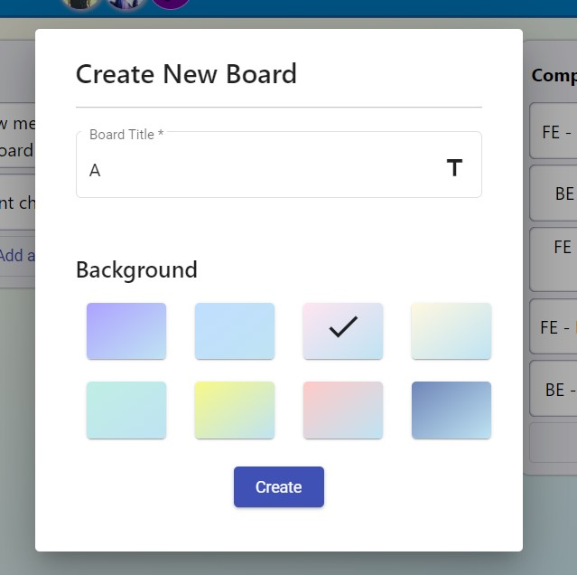

# Task Management Tool - TMT
<b>Task Management Tool - TMT </b> is a basic task tracker application inspired from "<b>Trello Board</b>".

# <h2> 📌 Features</h2>
 - [x] Authorization
 - [x] Authentication ( Registration and Login )
 - [x] Create/update/delete new board
 - [x] Add/update/delete list in a board
 - [x] Add/update/delete card in a list
 - [x] Add comment in a card
 - [x] Update order of cards in a list
 - [x] Move card from one list to another list
 - [x] Add new member to a board
     - [x] Show members in board
     - [x] Show all shared boards
 - [x] Change background of a board
 - [x] Show/update user profile
 - [ ] Add label in a card
 - [ ] Move list
 
# <h2> 📌 Tech Stack</h2>


# <h2> 📌 Getting Started</h2>
1. Install [Python](https://www.python.org/downloads/), [Yarn](https://classic.yarnpkg.com/en/docs/install/)
2. Clone the repo
```
$ git clone https://github.com/rezwan2525/task-management-tool.git
$ cd task-management-tool
```
3. Install [pipenv](https://pypi.org/project/pipenv/), a python virtual environment manager. Install backend dependencies and run migrations to create database. Default database is SQLite.
```
$ cd backend
$ pipenv install
$ pipenv shell
$ python manage.py migrate
```
4. Install frontend dependencies.
```
$ cd frontend
$ yarn install
```
5. Run both frontend and backend servers with following commands in appropriate directories.
```
$ python manage.py runserver
$ yarn start
```
# <h2> 📌 API Documentations</h2>
After running the backend server, the API doc will be at `http://localhost:8000/docs/`

# <h2> 📌 Project Showcase Video</h2>
<a href="https://www.youtube.com/watch?v=gKZRjWhq6eA" target="_blank">
	
</a>

# <h2> 📌 Screenshots</h2>
|     |  |
|---------------------------------------------------------------------|:--------------------------------------------------------------------:|
|     |  |


<div align="center">

### Show some ❤️ by starring⭐ this awesome Repository!

</div>
  

#

<h3 align=center> OUR VALUABLE CONTRIBUTORS✨ </h3>
<p align="center">
  
	
<a href="https://github.com/rezwan2525/task-management-tool/graphs/contributors"> 
  
</a>
</p>

#
	

<h3 align=center> Project Admin ❤️ </h3>

© 2022 Rezwan Al Kaoser and contributors\
This project is licensed under the [**MIT license**](https://github.com/rezwan2525/task-management-tool/blob/main/LICENSE).

[](https://forthebadge.com)
<a href="#top"></a>

<p align="center">
<table align="center">
  <tbody><tr>
     <td align="center"><a href="https://github.com/rezwan2525"><br><sub><b> Rezwan Al Kaoser </b></sub></a><br></td> </a></td>
</tbody></table>
 
